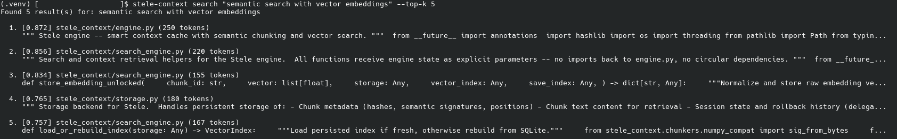
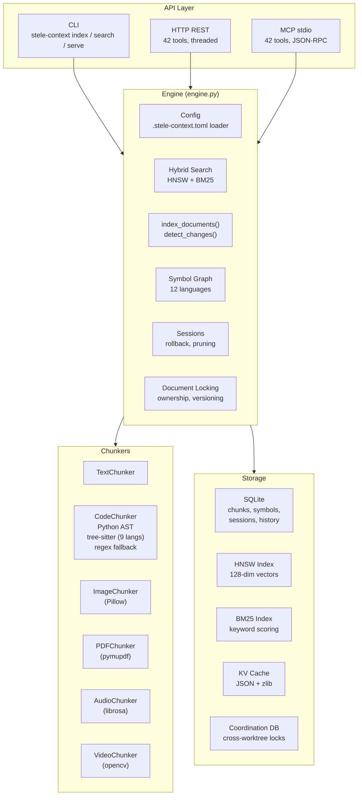

# Stele Context

**Local context cache for LLM agents with semantic chunking and vector search.**

[](https://pypi.org/project/stele-context/)
[](https://opensource.org/licenses/MIT)
[](https://www.python.org/downloads/)
[](https://github.com/IronAdamant/stele-context)
[](https://github.com/IronAdamant/stele-context/actions)

Stele Context helps LLM agents avoid re-reading unchanged files by caching chunk data with semantic search. Documents are routed through modality-specific chunkers, chunk content is stored in SQLite, and an HNSW vector index enables fast O(log n) retrieval. Only modified chunks trigger reprocessing.



## Key Features

- **100% Offline & Local-Only**: No internet access, no external API calls, no cloud components
- **Zero Required Dependencies**: Runs on Python stdlib alone — no supply chain risks
- **Multi-Modal Support**: Text, code, images, PDFs, audio, and video (optional dependencies)
- **HNSW Vector Index**: O(log n) semantic search across all indexed chunks
- **Hybrid Search**: HNSW cosine similarity + BM25 keyword matching, auto-tuned blending
- **Tree-Sitter Chunking**: AST-aware code chunking for 9 languages (optional, falls back to regex)
- **Symbol Graph**: Cross-file reference tracking — `find_references`, `find_definition`, `impact_radius`
- **Multi-Agent Safe**: Per-document locking, optimistic versioning, cross-worktree coordination
- **MCP Server**: JSON-RPC over stdio for Claude Desktop, HTTP REST for other agents
- **Project Config**: `.stele-context.toml` file for per-project settings
- **Session Management**: Sessions with rollback, pruning, and KV-cache persistence

## Architecture



## Comparison

| Feature | Stele Context | LangChain | LlamaIndex | EverMemOS |
|---------|-------|-----------|------------|-----------|
| Zero dependencies | Yes | No (50+) | No (30+) | No (Mongo, Redis, Milvus) |
| 100% offline | Yes | No | No | No |
| No model downloads | Yes | No | No | No |
| Multi-modal | 6 modalities | Text-focused | Text-focused | Text only |
| Code-aware chunking | AST + tree-sitter | Basic splitting | Basic splitting | No |
| Symbol graph | 12 languages | No | No | No |
| Multi-agent safety | Locks + versioning | No | No | Yes |
| MCP server | Native | Plugin | Plugin | Planned |
| Storage | SQLite (embedded) | Vector DB (external) | Vector DB (external) | MongoDB + Milvus |

## Installation

```bash
# From PyPI (import as: import stele_context)
pip install stele-context

# With optional extras
pip install stele-context[performance]    # faster vector math
pip install stele-context[tree-sitter]    # AST-aware code chunking
pip install stele-context[all]            # everything
```

> **Note:** The PyPI package is `stele-context` and the import name is `stele_context`.

```bash
# From source
git clone https://github.com/IronAdamant/stele-context.git
cd stele-context
pip install -e .

# With dev dependencies
pip install -e ".[dev]"
```

### Requirements

- Python 3.9+
- **Zero required dependencies**

### Optional Extras (all 100% offline)

| Extra | Packages | Use Case |
|-------|----------|----------|
| `performance` | msgspec, numpy | Faster serialization & vector math |
| `image` | Pillow | Image indexing & similarity |
| `pdf` | pymupdf | PDF text extraction |
| `audio` | librosa, numpy | Audio segmentation & features |
| `video` | opencv-python, numpy | Video keyframe extraction |
| `tree-sitter` | tree-sitter + 9 grammar packages | AST-aware code chunking for JS/TS, Java, C/C++, Go, Rust, Ruby, PHP |
| `mcp` | mcp | MCP stdio server for Claude Desktop |
| `all` | All of the above | Everything |

```bash
pip install stele-context[tree-sitter]   # AST-aware code chunking
pip install stele-context[image,pdf]     # Multi-modal
pip install stele-context[all]           # Everything
```

## Quick Start

### 1. Index Documents

```bash
stele-context index src/*.py docs/*.md
stele-context index --force document.py    # Force re-index
```

### 2. Semantic Search

```bash
stele-context search "authentication logic" --top-k 5
stele-context search "error handling" --json
```

### 3. MCP Server (for Claude Code / Claude Desktop)

```bash
pip install stele-context[mcp]
stele-context serve-mcp
```

**Claude Code** (`~/.claude/settings.json`):
```json
{
  "mcpServers": {
    "stele-context": {
      "command": "stele-context",
      "args": ["serve-mcp"]
    }
  }
}
```

**Claude Desktop** (`~/.config/Claude/claude_desktop_config.json`):
```json
{
  "mcpServers": {
    "stele-context": {
      "command": "stele-context",
      "args": ["serve-mcp"]
    }
  }
}
```

> **Tip:** If installed in a virtualenv, use the full path to the `stele-context` binary.

### 4. HTTP REST Server

```bash
stele-context serve --port 9876
```

### 5. Project Configuration

Create `.stele-context.toml` in your project root:

```toml
[stele-context]
chunk_size = 512
max_chunk_size = 8192
merge_threshold = 0.75
change_threshold = 0.90
search_alpha = 0.6
skip_dirs = [".git", "node_modules", "dist", "vendor"]
```

All values are optional — constructor params and env vars override config file values.

## Python API

```python
from stele_context import Stele

engine = Stele()

# Index documents (auto-detects modality, walks directories)
result = engine.index_documents(["src/", "README.md"])
print(f"Indexed {result['total_chunks']} chunks")

# Hybrid semantic search (HNSW + BM25)
results = engine.search("authentication logic", top_k=5)
for r in results:
    print(f"[{r['relevance_score']:.3f}] {r['document_path']}")
    print(f"  {r['content'][:100]}...")

# Get cached context — unchanged chunks skip reprocessing
context = engine.get_context(["src/main.py", "src/utils.py"])
for doc in context["unchanged"]:
    print(f"{doc['path']}: {len(doc['chunks'])} cached chunks")

# Symbol graph — cross-file reference tracking
refs = engine.find_references("Stele")
defn = engine.find_definition("StorageBackend")

# Impact analysis — what breaks if this changes?
impact = engine.impact_radius(chunk_id="abc123", depth=2)

# Staleness detection — find chunks with stale dependencies
stale = engine.stale_chunks(threshold=0.3)

# Chunk version history
history = engine.get_chunk_history(document_path="src/main.py")

# Session management
engine.save_kv_state("session-1", {"chunk_id": {"key": "value"}})
engine.rollback("session-1", target_turn=2)
engine.prune_chunks("session-1", max_tokens=100000)

# Multi-agent document locking
engine.acquire_document_lock("src/main.py", agent_id="agent-alpha")
engine.index_documents(["src/main.py"], agent_id="agent-alpha")
engine.release_document_lock("src/main.py", agent_id="agent-alpha")
```

### Configuration

```python
engine = Stele(
    chunk_size=256,           # Target tokens per initial chunk
    max_chunk_size=4096,      # Maximum tokens per merged chunk
    merge_threshold=0.7,      # Similarity threshold for merging
    change_threshold=0.85,    # Similarity threshold for "unchanged"
    search_alpha=0.7,         # Blend: 1.0 = pure vector, 0.0 = pure keyword
)
```

Or use `.stele-context.toml` (see above) — constructor params override config file values.

### Agent-Supplied Semantic Embeddings

LLM agents already understand the semantics of every chunk they read. Instead of using a separate embedding model, Stele Context captures the agent's understanding directly:

```python
# After indexing, the agent describes what each chunk does
engine.store_semantic_summary(
    chunk_id="abc123",
    summary="JWT authentication middleware that validates bearer tokens and attaches user identity to request context"
)

# Now searches like "token validation" match far better than
# statistical signatures on raw code would
results = engine.search("token validation middleware")
```

The agent IS the embedding model. Stele Context just stores and indexes what the agent tells it — zero new dependencies, no model downloads, no API calls.

**How it works:**
- **Tier 1** (always): 128-dim statistical signatures — trigrams, bigrams, structural features. Used for change detection.
- **Tier 2** (optional): Agent-supplied semantic summaries. Stele computes a signature from the summary text and uses it for HNSW search. ~9% improvement on semantic queries.
- **Tier 2 alt**: `store_embedding(chunk_id, vector)` for agents with direct embedding API access.

## MCP Tools

### Both Servers (42 tools each)

Both the HTTP REST server and MCP stdio server expose all 42 tools via a unified registry.

| Category | Tools |
|----------|-------|
| **Indexing** | `index`, `remove`, `detect_changes`, `detect_modality`, `get_supported_formats` |
| **Search** | `search`, `search_text`, `get_context`, `get_relevant_kv` |
| **Annotations** | `annotate`, `get_annotations`, `delete_annotation`, `update_annotation`, `search_annotations`, `bulk_annotate` |
| **Sessions** | `save_kv_state`, `rollback`, `prune_chunks`, `list_sessions` |
| **Symbols** | `find_references`, `find_definition`, `impact_radius`, `rebuild_symbols`, `stale_chunks` |
| **Locking** | `acquire_document_lock`, `release_document_lock`, `refresh_document_lock`, `get_document_lock_status`, `release_agent_locks`, `reap_expired_locks` |
| **History** | `get_conflicts`, `get_chunk_history`, `get_notifications`, `history`, `prune_history` |
| **Stats & Map** | `stats`, `map` |
| **Embeddings** | `store_semantic_summary`, `store_embedding` |
| **Utilities** | `list_agents`, `environment_check`, `clean_bytecache` |

## How It Works

### Change Detection

```
For each chunk:
  1. SHA-256 hash → exact match → instant cache hit (0 tokens)
  2. Hash differs → compute 128-dim semantic signature
  3. Cosine similarity > threshold → semantically similar → restore KV
  4. Similarity ≤ threshold → significant change → reprocess
```

### Token Savings

| Scenario | Without Stele Context | With Stele Context | Savings |
|----------|---------------|------------|---------|
| Unchanged document | 10,000 tokens | 0 tokens | 100% |
| Minor edit (typo) | 10,000 tokens | ~100 tokens | 99% |
| Moderate edit | 10,000 tokens | ~1,000 tokens | 90% |
| Major rewrite | 10,000 tokens | 10,000 tokens | 0% |

### Code Chunking Strategy

| Language | Parser | Fallback |
|----------|--------|----------|
| Python | stdlib `ast` (always) | regex |
| JS/TS, Java, C/C++, Go, Rust, Ruby, PHP | tree-sitter (optional) | regex patterns |
| Shell, Swift, SQL, config files | regex patterns | line-based |

Tree-sitter provides proper AST boundary detection for function/class definitions.
Install with `pip install stele-context[tree-sitter]`.

### Storage Layout

```
<project_root>/.stele-context/          # Per-worktree (default)
├── stele_context.db                    # SQLite: chunks, symbols, sessions, history
├── kv_cache/                           # JSON + zlib compressed KV states
└── indices/                            # HNSW + BM25 persistent indices

<git-common-dir>/stele-context/         # Shared across worktrees
└── coordination.db                     # Agent registry, shared locks, notifications
```

## Multi-Agent Support

Stele Context supports multiple LLM agents sharing one store on the same machine.

| Layer | Protection |
|-------|-----------|
| **Thread safety** | RWLock — concurrent reads, exclusive writes |
| **Process safety** | `fcntl.flock()` on index files |
| **Document ownership** | `acquire_document_lock()` with TTL expiry |
| **Optimistic locking** | `doc_version` compare-and-swap |
| **Cross-worktree** | Shared coordination DB for locks, agent registry, notifications |
| **Conflict log** | Full audit trail of ownership violations |

## Performance

Run benchmarks:
```bash
python benchmarks/run_all.py          # Full suite
python benchmarks/run_all.py --quick  # CI mode
```

Representative results (quick mode):

| Operation | Size | Time | Throughput |
|-----------|------|------|------------|
| TextChunker | 10KB | 1.6ms | 6,100 KB/s |
| CodeChunker (AST) | 10KB | 5.7ms | 1,750 KB/s |
| store_chunk (batch) | 100 | 27ms | 3,700 ops/s |
| VectorIndex.search (k=10) | 500 nodes | 4.7ms | 212 qps |
| BM25.score_batch | 100 docs | 0.18ms | 556K docs/s |
| engine.search (hybrid) | 50 docs | 9.9ms | 101 qps |

## Security & Supply Chain

- **Zero required dependencies** — no supply chain attack surface for core functionality
- **No model downloads** — semantic signatures use statistical features, not ML models
- **No API calls** — everything runs locally, no data leaves your machine
- **No pickle** — session data serialized with JSON+zlib
- **Minimal codebase** — ~10,000 lines of Python, easy to audit

```bash
# Maximum security: install with zero dependencies
pip install stele-context --no-deps
```

## Supported Formats

### Text & Code (Zero Dependencies)
`.txt`, `.md`, `.rst`, `.csv`, `.log`, `.py`, `.js`, `.ts`, `.jsx`, `.tsx`, `.java`, `.cpp`, `.c`, `.h`, `.go`, `.rs`, `.rb`, `.php`, `.swift`, `.sh`, `.json`, `.yaml`, `.toml`, `.html`, `.css`, `.sql`

### Images (requires Pillow)
`.png`, `.jpg`, `.jpeg`, `.gif`, `.webp`, `.bmp`, `.tiff`, `.ico`

### PDFs (requires pymupdf)
`.pdf`

### Audio (requires librosa)
`.mp3`, `.wav`, `.ogg`, `.flac`, `.m4a`, `.aac`, `.wma`

### Video (requires opencv-python)
`.mp4`, `.avi`, `.mov`, `.mkv`, `.webm`, `.flv`, `.wmv`

## Configuration Reference

### Environment Variables

| Variable | Description |
|----------|-------------|
| `STELE_CONTEXT_STORAGE_DIR` | Override default storage directory |
| `STELE_CONTEXT_LOG_LEVEL` | Logging level (DEBUG, INFO, WARNING, ERROR) |

### Config File (`.stele-context.toml`)

```toml
[stele-context]
storage_dir = ".stele-context"       # Storage directory (relative to project root)
chunk_size = 256              # Target tokens per initial chunk
max_chunk_size = 4096         # Maximum tokens per merged chunk
merge_threshold = 0.7         # Similarity threshold for merging chunks
change_threshold = 0.85       # Similarity threshold for "unchanged"
search_alpha = 0.7            # Hybrid search blend (1.0=vector, 0.0=keyword)
skip_dirs = [".git", "node_modules", "__pycache__"]
```

Priority: constructor params > `.stele-context.toml` > `STELE_CONTEXT_STORAGE_DIR` env var > defaults.

## FAQ

**Q: Does Stele Context require an internet connection?**
No. Stele Context is 100% offline. No API calls, no model downloads, no telemetry. All operations run locally using Python stdlib.

**Q: How does Stele Context compare to RAG (Retrieval-Augmented Generation)?**
Stele Context is not RAG — it's a context cache. RAG retrieves chunks at query time from an external store. Stele Context caches chunk KV-states so the LLM skips re-reading unchanged content. It can be used alongside RAG, but its primary value is token savings through change detection.

**Q: What happens if tree-sitter isn't installed?**
Code chunking falls back to regex patterns for non-Python languages. Python always uses stdlib `ast`. Install tree-sitter for better accuracy on JS/TS, Java, C/C++, Go, Rust, Ruby, PHP: `pip install stele-context[tree-sitter]`.

**Q: Can multiple agents use Stele Context simultaneously?**
Yes. Stele Context provides per-document locking, optimistic versioning, and a cross-worktree coordination DB. Both HTTP and MCP servers auto-register agents and inject agent IDs into write operations.

**Q: How accurate are the semantic signatures?**
The 128-dim statistical signatures (trigrams, bigrams, structural features) are approximate. They're designed for change detection (same vs different), not for embedding-quality similarity. For typical code and documentation, they achieve ~95% accuracy on change detection.

**Q: Where is data stored?**
By default, `<project_root>/.stele-context/` (each git worktree gets its own). Override with `STELE_CONTEXT_STORAGE_DIR` or `storage_dir` in `.stele-context.toml`. Cross-worktree coordination data lives in `<git-common-dir>/stele-context/coordination.db`.

## Troubleshooting

**`ImportError: No module named 'stele_context'`**
Ensure Stele Context is installed: `pip install -e .` from the repo root. If using a virtualenv, make sure it's activated.

**MCP server not connecting in Claude Desktop**
Use the full path to the `stele-context` binary. Check with `which stele-context` and update your config. If installed in a virtualenv: `/path/to/.venv/bin/stele-context`.

**`PermissionError` when indexing**
Another agent holds a lock on the document. Check with `get_document_lock_status()` or `reap_expired_locks()` to clean up stale locks.

**Slow search on large indices**
The HNSW index adapts search width automatically. For 10K+ chunks, search uses 4x `ef_search`. If still slow, reduce `top_k` or check that the BM25 index isn't being rebuilt on every query (it's lazy-loaded once).

**Tree-sitter not working for a language**
Verify the grammar package is installed: `pip install tree-sitter-javascript` (etc.). Check with: `python -c "from stele_context.chunkers.code import HAS_TREE_SITTER; print(HAS_TREE_SITTER)"`.

**Stale `.pyc` files causing issues**
Run `stele-context` with the `environment_check` MCP tool, or call `engine.check_environment()`. Use `engine.clean_bytecache()` to remove orphaned `.pyc` files.

## Development

```bash
pip install -e ".[dev]"
pytest                              # 573 tests
pytest --cov=stele_context           # With coverage
python benchmarks/run_all.py        # Performance benchmarks
mypy stele_context/                 # Type checking
ruff check stele_context/           # Linting
```

Entry points: `stele-context` (CLI), `stele-context-mcp` (MCP stdio server)

## Contributing

See [CONTRIBUTING.md](CONTRIBUTING.md) for guidelines.

## License

MIT License — see [LICENSE](LICENSE) for details.
