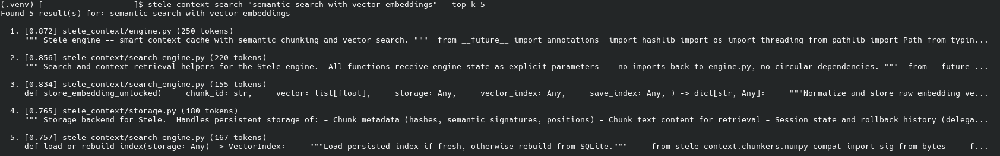

# Stele Context

**Persistent memory for AI coding agents. A zero-dependency MCP server that lets Claude Code, Claude Desktop, Cursor, and any MCP-compatible AI coding assistant remember your codebase between conversations — instead of re-reading every file from scratch.**

[](https://pypi.org/project/stele-context/)
[](https://opensource.org/licenses/MIT)
[](https://www.python.org/downloads/)
[](https://github.com/IronAdamant/stele-context)
[](https://github.com/IronAdamant/stele-context/actions)

## The Problem: AI Agents Re-Read Everything

Every new conversation with Claude Code, Cursor, or any other LLM coding tool starts from zero. The agent re-reads the same files it read yesterday, burning thousands of tokens on code that hasn't changed. On a medium-sized project that's real money and real context-window space spent re-learning what the agent already knew.

Stele Context is a local context cache that fixes this: index once, then only pay for what actually changed.

## What It Does

1. **Indexes your project files once** — code, docs, configs, even images and PDFs — into a local SQLite database
2. **Detects file changes** with an mtime+size fast path and SHA-256 verification — unchanged files cost zero re-reads
3. **Returns a diff instead of the whole file** when something did change — a 1-line edit in a 600-line file comes back as a ~60-token unified diff, not a 10,000-token re-read
4. **Searches your codebase** by meaning, keyword, or exact pattern — semantic code search, BM25, and token-budgeted grep in one tool
5. **Maps how your code connects** — a symbol graph for find-references, go-to-definition, and "what breaks if I change this file?" impact analysis

Everything runs **100% offline on your machine**. No internet, no API keys, no cloud, no telemetry. Just Python's standard library and SQLite.



## Quick Start

### Install

```bash
pip install stele-context
```

### First-run setup (recommended)

```bash
stele-context init .
```

This indexes the project (respecting `.gitignore`), prints a ready-to-paste **MCP lite** client config, and shows `doctor` next-steps for a cold agent. Prefer this over a bare `index` when wiring Stele for the first time.

### Index your project

```bash
stele-context index src/ docs/ README.md
```

This chunks your files and stores them in a `.stele-context/` folder in your project root. Indexing **respects your `.gitignore`** out of the box, so `node_modules/`, build output, and secrets stay out of the index.

### Search your code

```bash
stele-context search "how does authentication work"
stele-context search-text "TODO" --regex
stele-context agent-grep "createApp" --group-by file
```

### Connect it to Claude Code, Claude Desktop, or Cursor

Stele Context runs as an [MCP server](https://modelcontextprotocol.io/) — the standard protocol for giving AI agents extra tools.

```bash
pip install stele-context[mcp]
```

**Claude Code** — add to `~/.claude/settings.json`:
```json
{
  "mcpServers": {
    "stele-context": {
      "command": "stele-context",
      "args": ["serve-mcp"],
      "env": { "STELE_MCP_MODE": "lite" }
    }
  }
}
```

**Claude Desktop** — add to `~/.config/Claude/claude_desktop_config.json` (Linux/Mac) or `%APPDATA%\Claude\claude_desktop_config.json` (Windows):
```json
{
  "mcpServers": {
    "stele-context": {
      "command": "stele-context",
      "args": ["serve-mcp"],
      "env": { "STELE_MCP_MODE": "lite" }
    }
  }
}
```

**Cursor, Windsurf, and other MCP clients** — point them at the same `stele-context serve-mcp` command; the configuration shape is the same. (`stele-context init` prints a ready-to-paste snippet.)

> **Tip:** If you installed in a virtualenv, use the full path: run `which stele-context` to find it.

Once connected, your agent gets the **lite** high-leverage tool set by default (~20 tools: `doctor`, `query`, `agent_grep`, symbols, cache, Tier-2 summaries). Set `STELE_MCP_MODE=standard` for the broader surface, or `full` for deprecated singleton tools.

### Recommended agent ritual

```
doctor → query (session_id) → agent_grep / find_* as needed → get_context (trust/diff)
```

After edits: `detect_changes`. To improve hybrid search: `enrichment-plan` then `bulk_store_summaries`.

### Search quality eval (CI / release gate)

```bash
python benchmarks/eval_search_quality.py --search-mode keyword --json --min-recall 0.40
python benchmarks/eval_search_quality.py --tier2-delta --min-recall 0.30
```

Keyword recall is gated in CI (`search-regression` job). The Tier-2 delta path reports hybrid recall with summaries off vs on.

## Who Is This For?

- You use **Claude Code**, **Claude Desktop**, **Cursor**, or another AI pair-programming tool
- You're tired of watching your agent re-read the same files at the start of every session
- You want to **cut token costs** and stop wasting context window on unchanged code
- You want **local code search** that understands your project — not a cloud RAG pipeline
- You care about **supply chain security** and want tooling you can audit end to end

If you've ever wished your AI coding assistant had a memory of your project, that's exactly what this is.

## What Can It Do?

### For everyday use

| What you want | How Stele helps |
|---------------|-----------------|
| "Don't re-read files that haven't changed" | `get_context` returns cached content for unchanged files — change detection via mtime+size fast path with SHA-256 verification |
| "Show me only what changed in a file I already read" | Changed files come back with `diff_since_cache` — a hash-exact, token-bounded unified diff against the cached version, with a `read_diff`/`reread_file` cost recommendation |
| "Don't index my build output and vendored deps" | Directory indexing respects `.gitignore` by default — anchored at your git project root, or at the indexed folder itself when there's no repo (`respect_gitignore = false` to opt out) |
| "Ask a broad question about my code" | `query` combines semantic search, the symbol graph, and text grep into one deduplicated result list |
| "What files would break if I change this?" | `impact_radius` follows the dependency chain to find affected files; `significance_threshold` filters noise from common symbols. Works with `symbol=` for dynamic/runtime hooks and `direction=` for outgoing or bidirectional traversal |
| "Which files are tightly coupled?" | `coupling` shows shared symbols with a `semantic_score` that discounts generic boilerplate; `mode=co_consumers` catches files imported together |
| "Find where this function is defined and used" | `find_references` / `find_definition` walk the symbol graph with a clear verdict: referenced, unreferenced, external, or not found |
| "Find every line matching a pattern" | `agent_grep` does text/regex search with scope annotation, classification, and a token budget |
| "Run several operations in one round-trip" | `batch` executes multiple tool calls under a single write lock |

### For power users

- **Multi-agent safe** — multiple AI agents share one index without stepping on each other (document locking, optimistic versioning, conflict detection)
- **Git worktree aware** — each worktree gets its own index, with shared coordination across all of them
- **Session management** — save and restore agent state between conversations (rollback, pruning, read-history)
- **Self-maintaining** — change history and telemetry auto-prune to configurable bounds; `doctor` reports index health and database growth
- **Many file types** — code (12 languages built in), text, Markdown, images, PDFs, audio, video (media types need optional packages)

## How Many Tokens Does It Save?

| What changed | Tokens without Stele | Tokens with Stele | Savings |
|--------------|---------------------|-------------------|---------|
| Nothing (same code) | 10,000 | 0 | 100% |
| A typo fix | 10,000 | ~60 (the diff) | 99% |
| Edited a few functions | 10,000 | ~1,000 (the diff) | 90% |
| Rewrote the whole file | 10,000 | 10,000 | 0% |

The diff numbers aren't aspirational: `diff_since_cache` reconstructs the cached version from stored chunks, verifies it against the file's stored hash, and returns a unified diff the agent reads instead of the file. When the diff would cost more than re-reading (tiny files, total rewrites), it says so explicitly.

## Zero Dependencies, By Design

`pip install stele-context` installs **exactly one package: this one.** The core runs on Python's standard library alone — the vector index (HNSW), BM25 ranking, Porter stemmer, TOML parser, diffing, and storage are all stdlib or hand-rolled and auditable in-repo.

This is a security posture, not a packaging quirk. Every dependency in an AI-agent toolchain is a supply chain attack surface — a tool your agent runs on every conversation should not pull in a dependency tree you can't read. There is no pickle anywhere (JSON-only serialization), no network code in the cache path, and ~17,000 lines of Python you can audit yourself.

Optional extras add capabilities **only if you opt in**:

```bash
pip install stele-context[tree-sitter]   # Better parsing for 9 more languages
pip install stele-context[image,pdf]     # Image and PDF support
pip install stele-context[performance]   # Faster math with numpy
pip install stele-context[all]           # Everything
```

<details>
<summary>Full extras list</summary>

| Extra | What it adds |
|-------|-------------|
| `performance` | Faster math for search (numpy, msgspec) |
| `tree-sitter` | Better code parsing for JS/TS, Java, C/C++, Go, Rust, Ruby, PHP |
| `image` | Index and search images (Pillow) |
| `pdf` | Extract text from PDFs (pymupdf) |
| `audio` | Index audio files (librosa) |
| `video` | Index video keyframes (opencv) |
| `mcp` | MCP server for Claude Desktop/Code |
| `all` | All of the above |

</details>

## Python API

You can also use Stele Context directly as a Python library:

```python
from stele_context import Stele

engine = Stele()

# Index your project
result = engine.index_documents(["src/", "README.md"])
print(f"Indexed {result['total_chunks']} chunks")

# Cached read: unchanged files come back from cache,
# changed files come back with a diff
ctx = engine.get_context(["src/main.py"])
for entry in ctx["changed"]:
    print(entry["diff_since_cache"]["diff"])

# Search by meaning or keywords
results = engine.search("authentication logic", top_k=5)
for r in results:
    print(f"{r['document_path']}: {r['content'][:100]}...")

# Check what changed since last time
changes = engine.detect_changes_and_update("my-session")
print(f"{len(changes['modified'])} files changed, {len(changes['new'])} new files")

# Find where a function/class is used
refs = engine.find_references("MyClassName")
print(f"Verdict: {refs['verdict']}")  # referenced, unreferenced, external, or not_found

# What breaks if I change this file?
impact = engine.impact_radius(document_path="src/main.py")
print(f"{impact['affected_files']} files could be affected")
```

## Configuration

Create a `.stele-context.toml` in your project root to customize behavior:

```toml
[stele-context]
chunk_size = 512                # How big each chunk is (in tokens)
skip_dirs = [".git", "node_modules", "dist", "vendor"]
```

All settings are optional — defaults work well for most projects.

<details>
<summary>All configuration options</summary>

```toml
[stele-context]
storage_dir = ".stele-context"   # Where to store the index
chunk_size = 256                 # Target tokens per chunk
max_chunk_size = 4096            # Maximum tokens per chunk
merge_threshold = 0.7            # When to merge similar adjacent chunks
change_threshold = 0.85          # When to consider a chunk "unchanged"
search_alpha = 0.42              # Balance between meaning-based and keyword search
skip_dirs = [".git", "node_modules", "__pycache__"]
respect_gitignore = true         # Skip .gitignore'd files when indexing directories
max_history_entries = 1000       # Auto-prune change history past this bound (0 = unlimited)
```

You can also set `STELE_CONTEXT_STORAGE_DIR` as an environment variable, or pass options directly in Python:

```python
engine = Stele(chunk_size=512, skip_dirs=[".git", "node_modules", "dist"])
```

Priority: Python arguments > `.stele-context.toml` > environment variables > defaults.

</details>

## Supported File Types

**Built-in (no extra packages needed):**
`.py`, `.js`, `.ts`, `.jsx`, `.tsx`, `.java`, `.cpp`, `.c`, `.h`, `.go`, `.rs`, `.rb`, `.php`, `.swift`, `.sh`, `.sql`, `.html`, `.css`, `.json`, `.yaml`, `.toml`, `.md`, `.txt`, `.rst`, `.csv`, `.log`

**With optional packages:**
Images (`.png`, `.jpg`, `.gif`, etc.), PDFs, audio (`.mp3`, `.wav`, etc.), video (`.mp4`, `.avi`, etc.)

## Troubleshooting

**`ImportError: No module named 'stele_context'`**
Make sure it's installed: `pip install stele-context`. If using a virtualenv, activate it first.

**MCP server not connecting**
Use the full path to the binary. Run `which stele-context` and put that path in your config.

**`PermissionError` when indexing**
Another agent might be holding a lock. Run the `reap_expired_locks` action of the `document_lock` tool to clean up.

**`diff_exact: false` on files indexed by an older version**
Caches built before v1.4.1 reconstruct diffs on a best-effort basis. Re-index the file once (`stele-context index <file>`) and diffs become hash-exact from then on. No migration needed.

**Tools report an old version or stale package metadata**
A leftover `*.egg-info/` directory in your project root shadows the installed package's metadata for any Python started there. `stele-context doctor` flags this as a `stale_egg_info` environment issue — delete the directory or rebuild the package.

## FAQ

**How do I make Claude Code remember my project between conversations?**
Install Stele Context and add it as an MCP server (see Quick Start). Once connected, Claude Code can index your project and recall file contents, symbol locations, and code structure across conversations — without re-reading everything.

**How does this reduce AI token costs on a large codebase?**
Unchanged files are served from the local cache at zero read cost, and changed files come back as a unified diff instead of full content. The agent's context window holds what's new, not what it already saw.

**Does this work with Cursor, Windsurf, or other AI coding tools?**
Yes. Stele Context speaks MCP, the standard protocol for agent tools — any MCP-compatible client can use it. There's also an HTTP REST API and a plain Python library for direct integration.

**Does it replace grep, file reads, or my editor's search?**
No — it complements them. Native tools stay best for one-off lookups; Stele adds the memory layer: what was already read, what changed since, and how symbols connect across files. Its `agent_grep` also auto-caches every file it searches, so searching and caching happen in one step.

**Does it need an internet connection or API keys?**
No. Everything runs locally — local-first by design. No API calls, no cloud, no model downloads, no telemetry.

**Is my code safe?**
Your code never leaves your machine. Zero third-party dependencies means no dependency tree to trust — about 17,000 lines of stdlib-only Python you can read and audit yourself, with JSON-only serialization (no pickle).

**Can multiple AI agents use it at the same time?**
Yes. Built-in document locking, optimistic version tracking, and a conflict log let parallel agents share one index safely — including across git worktrees.

**Where is the data stored?**
In a `.stele-context/` folder in your project root. It's a SQLite database plus index files. Each git worktree gets its own, and history tables auto-prune so it doesn't grow unbounded.

**How is this different from CLAUDE.md or project memory files?**
CLAUDE.md gives your agent instructions. Stele Context gives it a searchable index of your entire codebase — every function, every import, every file relationship — plus change tracking, so it can answer "where is this used?" or "what changed since I last read this?" without re-reading anything.

## Learn More

- [AGENTS.md](AGENTS.md) — How AI agents should use Stele Context
- [Design philosophy](docs/philosophy.md) — Why it's built this way
- [Agent workflow](docs/agent-workflow.md) — Step-by-step agent integration guide
- [CHANGELOG](CHANGELOG.md) — What changed in each version
- [Technical architecture](docs/architecture.md) — Deep dive into internals

## Development

```bash
pip install -e ".[dev]"
pytest                              # 930+ tests
pytest --cov=stele_context           # With coverage
mypy stele_context/                 # Type checking
ruff check stele_context/           # Linting
```

### Releases
Releases are managed using the `stele-context release` command. See [docs/release-automation.md](docs/release-automation.md) for the release policy and Grok Build automation details.

## Contributing

See [CONTRIBUTING.md](CONTRIBUTING.md) for guidelines.

## License

MIT License — see [LICENSE](LICENSE) for details.
