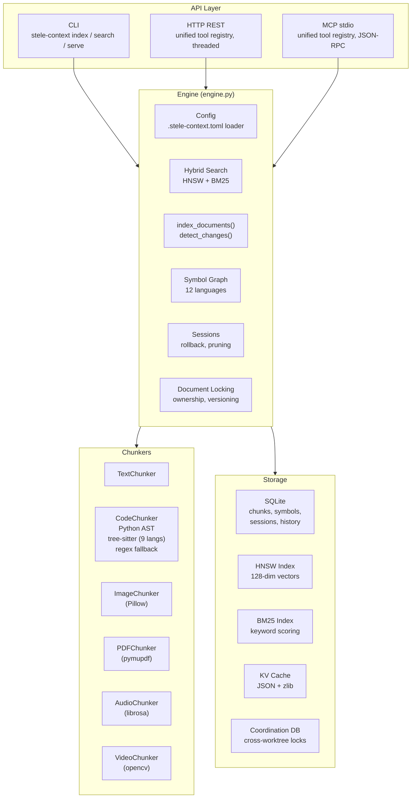

# Technical Architecture

This document covers Stele Context's internals for contributors and users who want to understand how things work under the hood. For getting started, see the [README](../README.md).

## System Overview



## How Search Works

Stele uses two complementary search strategies and blends their results:

**Vector search (HNSW)** — Each chunk gets a 128-dimensional "fingerprint" (signature) based on its content structure: character patterns, word frequency, code structure. These signatures are stored in an HNSW index, a data structure optimized for finding similar vectors quickly — O(log n) instead of comparing every chunk. Good at finding conceptually related code even when exact keywords differ.

**Keyword search (BM25)** — A standard information retrieval algorithm that scores chunks by how well their words match your query, weighted by rarity. If you search for "authentication," chunks containing that word rank higher, especially if "authentication" is uncommon in the overall index.

**Blending** — Results from both methods are combined using a tunable weight (`search_alpha`, default 0.42 — slightly favoring keywords). The system automatically falls back to keyword-only results when the vector scores are weak or the two methods disagree significantly. You can also force keyword-only mode with `search_mode=keyword`.

## Semantic Signatures

Every chunk gets a 128-dimensional statistical signature (Tier 1). These aren't neural embeddings — they're computed from content features using only Python's standard library:

| Dimensions | What they capture |
|-----------|-------------------|
| 0-63 | Character trigram frequencies |
| 64-79 | Word unigram frequencies |
| 80-95 | Word bigram frequencies |
| 96-103 | Structural features (indentation, brackets, keywords) |
| 104-115 | Positional features (where in the document) |
| 116-127 | Reserved |

Signatures are normalized to unit vectors. Similarity is measured by cosine distance. Accuracy for change detection (same vs different) is ~95%.

**Tier 2 (optional)** — Agents can supply their own semantic descriptions or raw embedding vectors via `store_semantic_summary()` or `store_embedding()`. These replace the statistical signature in the HNSW index, improving search quality by ~9% on semantic queries. The agent IS the embedding model — no extra dependencies needed.

## Symbol Graph

Stele builds a graph of how symbols (functions, classes, variables, imports) connect across files.

**Extraction** — Each indexed file is parsed for symbol definitions and references:
- Python: Uses stdlib `ast` for precise extraction (AST walk). Falls back to regex if parsing fails.
- JavaScript/TypeScript: Regex patterns for functions, classes, const/let/var, imports, requires, module.exports (including destructured exports and spread re-exports), method calls, DOM APIs.
- HTML/CSS: Cross-language linking — HTML class/id attributes connect to CSS selectors, `<script src>` connects to JS files.
- Java, Go, Rust, C/C++, Ruby, PHP: Regex patterns for language-specific constructs.

**Edge resolution** — After extraction, references are matched to definitions across files. Module path hints (from import statements) disambiguate when multiple files define the same name. A noise filter (`_NOISE_REFS`) suppresses edges through ubiquitous names like `path`, `fs`, `console`, `toString`, `getStats`, etc.

**Queries built on the graph:**
- `find_references(symbol)` — All definitions and usages, with a verdict: `referenced`, `unreferenced` (dead code candidate), `external` (defined outside indexed files), `not_found`.
- `find_definition(symbol)` — Where a symbol is defined, with full chunk content.
- `impact_radius(document_path)` — BFS through the dependency graph to find files affected by a change.
- `coupling(document_path)` — Files connected via shared symbol edges, with direction and shared symbol names.
- `stale_chunks(threshold)` — After a file changes, staleness propagates through the graph with exponential decay (0.8^depth).

## Code Chunking

Files are split into meaningful chunks rather than arbitrary fixed-size blocks:

| Language | Primary parser | Fallback |
|----------|---------------|----------|
| Python | stdlib `ast` (always available) | regex |
| JS/TS, Java, C/C++, Go, Rust, Ruby, PHP | tree-sitter (optional) | regex patterns |
| Shell, Swift, SQL, config files | regex patterns | line-based |

**Merge guard** — Adjacent chunks are merged if their signatures are similar enough (configurable threshold), but code chunks starting with definition boundaries (`def`, `class`, `function`, `const`, `describe(`, `it(`, `test(`) are never merged with the preceding chunk.

**Per-modality thresholds** — Code uses tighter thresholds (merge=0.85, change=0.80) to preserve function/class boundaries. Text uses looser thresholds (merge=0.70, change=0.85).

## Change Detection

```
For each file:
  1. Check mtime + file size against stored values
     → Both match? Skip entirely (fast path, no file read needed)
  2. Read file and compute SHA-256 hash
     → Hash matches stored hash? Unchanged (0 tokens to reprocess)
  3. Hash differs → compute semantic signature
     → Cosine similarity > threshold? Semantically similar (restore cached state)
  4. Similarity below threshold → Significant change (full reprocess)
```

The mtime+size fast path means most unchanged files are detected without even opening them.

## Storage Layout

```
<project_root>/.stele-context/          # Per-worktree (default)
├── stele_context.db                    # SQLite: chunks, symbols, sessions, history
├── kv_cache/                           # JSON + zlib compressed KV states
└── indices/                            # HNSW + BM25 persistent indices
    ├── hnsw_index.json.zlib
    └── bm25_index.json.zlib

<git-common-dir>/stele-context/         # Shared across worktrees
└── coordination.db                     # Agent registry, shared locks, notifications
```

SQLite tables: `chunks`, `chunk_history`, `documents`, `sessions`, `session_chunks`, `annotations`, `change_history`, `symbols`, `symbol_edges`, `document_conflicts`.

Coordination DB tables: `agents`, `shared_locks`, `shared_conflicts`.

## Multi-Agent Safety

Multiple AI agents can share one Stele index safely. Protection is layered:

| Layer | Mechanism | What it prevents |
|-------|-----------|-----------------|
| **Thread safety** | Read-write lock (`RWLock`) | Concurrent reads allowed, writes are exclusive |
| **Process safety** | File locking (`fcntl.flock` on Unix, `msvcrt.locking` on Windows) | Two processes writing the same index file |
| **Document ownership** | `document_lock(action="acquire", document_path, agent_id, ttl)` | Two agents editing the same file — locks auto-expire after TTL |
| **Optimistic locking** | `doc_version` column, compare-and-swap on write | Silent overwrites — rejects write if version changed since last read |
| **Cross-worktree coordination** | Shared SQLite DB in git common dir | Agents in different worktrees stepping on each other |
| **Conflict audit log** | `document_conflicts` table | Forensics — who overwrote what and when |

MCP servers auto-register an agent ID and inject it into write operations, so coordination is transparent to the agent.

## MCP Tool Reference

The HTTP REST server and MCP stdio server expose the same tools via a unified registry (`tool_registry.py`). Standard mode registers 42 MCP tools; `STELE_MCP_MODE=lite` registers ~15; `STELE_MCP_MODE=full` restores deprecated singleton tools.

| Category | Tools |
|----------|-------|
| **Indexing** | `index`, `remove`, `detect_changes`, `detect_modality`, `get_supported_formats` |
| **Search** | `query`, `agent_grep`, `search_text`, `search`, `get_context`, `get_relevant_kv`, `get_search_history`, `get_session_read_files` |
| **Annotations** | `annotations` (create/get/update/delete/search/bulk_create) |
| **Sessions** | `save_kv_state`, `rollback`, `prune_chunks`, `list_sessions` |
| **Symbols** | `find_references`, `find_definition`, `impact_radius`, `coupling`, `rebuild_symbols`, `stale_chunks` |
| **Locking** | `document_lock` (acquire/release/refresh/status/reap/release_agent/conflicts) |
| **History** | `get_conflicts`, `get_chunk_history`, `get_notifications`, `history`, `prune_history` |
| **Stats** | `map`, `doctor` |
| **Embeddings** | `bulk_store_summaries`, `llm_embed`, `bulk_store_embeddings`, `bulk_store_chunk_agent_notes` |
| **Dynamic symbols** | `register_dynamic_symbols`, `get_dynamic_symbols`, `remove_dynamic_symbols` |
| **Utilities** | `batch`, `list_agents`, `environment_check`, `clean_bytecache` |

## Performance Benchmarks

Run with:
```bash
python benchmarks/run_all.py          # Full suite
python benchmarks/run_all.py --quick  # CI mode
```

Representative results (quick mode, single machine):

| Operation | Scale | Time | Throughput |
|-----------|-------|------|------------|
| Text chunking | 10KB file | 1.6ms | 6,100 KB/s |
| Code chunking (Python AST) | 10KB file | 5.7ms | 1,750 KB/s |
| Storing chunks (batch) | 100 chunks | 27ms | 3,700 ops/s |
| Vector search (k=10) | 500 chunks | 4.7ms | 212 queries/s |
| Keyword scoring | 100 documents | 0.18ms | 556K docs/s |
| Full hybrid search | 50 documents | 9.9ms | 101 queries/s |

## Thread Safety Model

- `RWLock` in `rwlock.py` wraps all engine public methods. Read methods (`search`, `get_context`, etc.) take a shared lock — any number can run concurrently. Write methods (`index_documents`, `detect_changes`, etc.) take an exclusive lock.
- BM25 index is lazy-loaded on first search using double-checked locking with a separate `threading.Lock`.
- The HTTP server (`ThreadedHTTPServer`) handles one request per thread. Safe because all engine access goes through `RWLock`.
- `ConnectionPool` in `connection_pool.py` gives each thread a single reused SQLite connection. Row factory is reset on each use to prevent state leakage between requests.

## Module Dependency Rules

- `engine.py` is the only file that wires everything together. All other modules are standalone.
- `index.py` (HNSW) and `bm25.py` have zero internal dependencies.
- `config.py` imports nothing from stele internals.
- `agent_grep.py` imports only `estimate_tokens` from `chunkers/base.py`.
- `coordination.py`, `agent_registry.py`, `change_notifications.py`, `lock_ops.py`, `env_checks.py` are all standalone with zero internal deps.
- No circular imports exist in the dependency graph.

For the full module table, see [COMPLETE_PROJECT_DOCUMENTATION.md](../COMPLETE_PROJECT_DOCUMENTATION.md).
