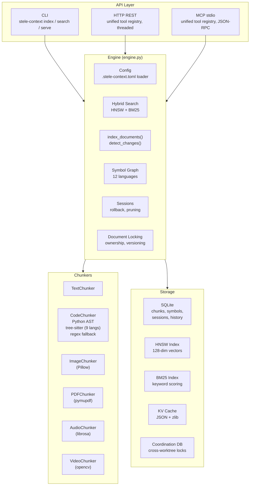

# Technical Architecture

This document covers Stele Context's internals for contributors and users who want to understand how things work under the hood. For getting started, see the [README](../README.md).

## System Overview



## How Search Works

Stele uses two complementary search strategies and blends their results:

**Vector search (HNSW)** — Each chunk gets a 128-dimensional "fingerprint" (signature) based on its content structure: character patterns, word frequency, code structure. These signatures are stored in an HNSW index, a data structure optimized for finding similar vectors quickly — O(log n) instead of comparing every chunk. Good at finding conceptually related code even when exact keywords differ.

**Keyword search (BM25)** — A standard information retrieval algorithm that scores chunks by how well their words match your query, weighted by rarity. If you search for "authentication," chunks containing that word rank higher, especially if "authentication" is uncommon in the overall index.

**Blending** — Results from both methods are combined using a tunable weight (`search_alpha`, default 0.42 — slightly favoring keywords). The system automatically falls back to keyword-only results when the vector scores are weak or the two methods disagree significantly. You can also force keyword-only mode with `search_mode=keyword`.

## Semantic Signatures

Every chunk gets a 128-dimensional statistical signature (Tier 1). These aren't neural embeddings — they're computed from content features using only Python's standard library:

| Dimensions | What they capture |
|-----------|-------------------|
| 0-63 | Character trigram frequencies |
| 64-79 | Word unigram frequencies |
| 80-95 | Word bigram frequencies |
| 96-103 | Structural features (indentation, brackets, keywords) |
| 104-115 | Positional features (where in the document) |
| 116-127 | Reserved |

Signatures are normalized to unit vectors. Similarity is measured by cosine distance. Accuracy for change detection (same vs different) is ~95%.

**Tier 2 (optional)** — Agents can supply their own semantic descriptions or raw embedding vectors via `store_semantic_summary()` or `store_embedding()`. These replace the statistical signature in the HNSW index, improving search quality by ~9% on semantic queries. The agent IS the embedding model — no extra dependencies needed.

## Symbol Graph

Stele builds a graph of how symbols (functions, classes, variables, imports) connect across files.

**Extraction** — Each indexed file is parsed for symbol definitions and references:
- Python: Uses stdlib `ast` for precise extraction (AST walk). Falls back to regex if parsing fails.
- JavaScript/TypeScript: Regex patterns for functions, classes, const/let/var, imports, requires, module.exports (including destructured exports and spread re-exports), method calls, DOM APIs.
- HTML/CSS: Cross-language linking — HTML class/id attributes connect to CSS selectors, `<script src>` connects to JS files.
- Java, Go, Rust, C/C++, Ruby, PHP: Regex patterns for language-specific constructs.

**Edge resolution** — After extraction, references are matched to definitions across files. Module path hints (from import statements) disambiguate when multiple files define the same name. A noise filter (`_NOISE_REFS`) suppresses edges through ubiquitous names like `path`, `fs`, `console`, `toString`, `getStats`, etc.

**Queries built on the graph:**
- `find_references(symbol)` — All definitions and usages, with a verdict: `referenced`, `unreferenced` (dead code candidate), `external` (defined outside indexed files), `not_found`.
- `find_definition(symbol)` — Where a symbol is defined, with full chunk content.
- `impact_radius(document_path)` — BFS through the dependency graph to find files affected by a change.
- `coupling(document_path)` — Files connected via shared symbol edges, with direction and shared symbol names.
- `stale_chunks(threshold)` — After a file changes, staleness propagates through the graph with exponential decay (0.8^depth).

## Code Chunking

Files are split into meaningful chunks rather than arbitrary fixed-size blocks:

| Language | Primary parser | Fallback |
|----------|---------------|----------|
| Python | stdlib `ast` (always available) | regex |
| JS/TS, Java, C/C++, Go, Rust, Ruby, PHP | tree-sitter (optional) | regex patterns |
| Shell, Swift, SQL, config files | regex patterns | line-based |

**Merge guard** — Adjacent chunks are merged if their signatures are similar enough (configurable threshold), but code chunks starting with definition boundaries (`def`, `class`, `function`, `const`, `describe(`, `it(`, `test(`) are never merged with the preceding chunk.

**Per-modality thresholds** — Code uses tighter thresholds (merge=0.85, change=0.80) to preserve function/class boundaries. Text uses looser thresholds (merge=0.70, change=0.85).

## Change Detection

```
For each file:
  1. Check mtime + file size against stored values
     → Both match? Skip entirely (fast path, no file read needed)
  2. Read file and compute SHA-256 hash
     → Hash matches stored hash? Unchanged (0 tokens to reprocess)
  3. Hash differs → compute semantic signature
     → Cosine similarity > threshold? Semantically similar (restore cached state)
  4. Similarity below threshold → Significant change (full reprocess)
```

The mtime+size fast path means most unchanged files are detected without even opening them.

## Storage Layout

```
<project_root>/.stele-context/          # Per-worktree (default)
├── stele_context.db                    # SQLite: chunks, symbols, sessions, history
├── kv_cache/                           # JSON + zlib compressed KV states
└── indices/                            # HNSW + BM25 persistent indices
    ├── hnsw_index.json.zlib
    └── bm25_index.json.zlib

<git-common-dir>/stele-context/         # Shared across worktrees
└── coordination.db                     # Agent registry, shared locks, notifications
```

SQLite tables: `chunks`, `chunk_history`, `documents`, `sessions`, `session_chunks`, `annotations`, `change_history`, `symbols`, `symbol_edges`, `document_conflicts`.

Coordination DB tables: `agents`, `shared_locks`, `shared_conflicts`.

## Multi-Agent Safety

Multiple AI agents can share one Stele index safely. Protection is layered:

| Layer | Mechanism | What it prevents |
|-------|-----------|-----------------|
| **Thread safety** | Read-write lock (`RWLock`) | Concurrent reads allowed, writes are exclusive |
| **Process safety** | File locking (`fcntl.flock` on Unix, `msvcrt.locking` on Windows) | Two processes writing the same index file |
| **Document ownership** | `document_lock(action="acquire", document_path, agent_id, ttl)` | Two agents editing the same file — locks auto-expire after TTL |
| **Optimistic locking** | `doc_version` column, compare-and-swap on write | Silent overwrites — rejects write if version changed since last read |
| **Cross-worktree coordination** | Shared SQLite DB in git common dir | Agents in different worktrees stepping on each other |
| **Conflict audit log** | `document_conflicts` table | Forensics — who overwrote what and when |

MCP servers auto-register an agent ID and inject it into write operations, so coordination is transparent to the agent.

## MCP Tool Reference

The HTTP REST server and MCP stdio server expose the same tools via a unified registry (`tool_registry.py`). Standard mode registers ~32 MCP tools; `STELE_MCP_MODE=lite` registers ~15; `STELE_MCP_MODE=full` restores deprecated singleton tools.

| Category | Tools |
|----------|-------|
| **Indexing** | `index`, `remove`, `detect_changes`, `detect_modality`, `get_supported_formats` |
| **Search** | `query`, `agent_grep`, `search_text`, `search`, `get_context`, `get_relevant_kv`, `get_search_history`, `get_session_read_files` |
| **Annotations** | `annotations` (create/get/update/delete/search/bulk_create) |
| **Sessions** | `save_kv_state`, `rollback`, `prune_chunks`, `list_sessions` |
| **Symbols** | `find_references`, `find_definition`, `impact_radius`, `coupling`, `rebuild_symbols`, `stale_chunks` |
| **Locking** | `document_lock` (acquire/release/refresh/status/reap/release_agent/conflicts) |
| **History** | `get_conflicts`, `get_chunk_history`, `get_notifications`, `history`, `prune_history` |
| **Stats** | `map`, `doctor` |
| **Embeddings** | `bulk_store_summaries`, `llm_embed`, `bulk_store_embeddings`, `bulk_store_chunk_agent_notes` |
| **Dynamic symbols** | `register_dynamic_symbols`, `get_dynamic_symbols`, `remove_dynamic_symbols` |
| **Utilities** | `batch`, `list_agents`, `environment_check`, `clean_bytecache` |

## Performance Benchmarks

Run with:
```bash
python benchmarks/run_all.py          # Full suite
python benchmarks/run_all.py --quick  # CI mode
```

Representative results (quick mode, single machine):

| Operation | Scale | Time | Throughput |
|-----------|-------|------|------------|
| Text chunking | 10KB file | 1.6ms | 6,100 KB/s |
| Code chunking (Python AST) | 10KB file | 5.7ms | 1,750 KB/s |
| Storing chunks (batch) | 100 chunks | 27ms | 3,700 ops/s |
| Vector search (k=10) | 500 chunks | 4.7ms | 212 queries/s |
| Keyword scoring | 100 documents | 0.18ms | 556K docs/s |
| Full hybrid search | 50 documents | 9.9ms | 101 queries/s |

## Thread Safety Model

- `RWLock` in `rwlock.py` wraps all engine public methods. Read methods (`search`, `get_context`, etc.) take a shared lock — any number can run concurrently. Write methods (`index_documents`, `detect_changes`, etc.) take an exclusive lock.
- BM25 index is lazy-loaded on first search using double-checked locking with a separate `threading.Lock`.
- The HTTP server (`ThreadedHTTPServer`) handles one request per thread. Safe because all engine access goes through `RWLock`.
- `ConnectionPool` in `connection_pool.py` gives each thread a single reused SQLite connection. Row factory is reset on each use to prevent state leakage between requests.

## Module Dependency Rules

- `engine.py` is the only file that wires everything together. All other modules are standalone.
- `index.py` (HNSW) and `bm25.py` have zero internal dependencies.
- `config.py` imports nothing from stele internals.
- `agent_grep.py` imports only `estimate_tokens` from `chunkers/base.py`.
- `coordination.py`, `agent_registry.py`, `change_notifications.py`, `lock_ops.py`, `env_checks.py` are all standalone with zero internal deps.
- No circular imports exist in the dependency graph.

For the full module table, see [COMPLETE_PROJECT_DOCUMENTATION.md](../COMPLETE_PROJECT_DOCUMENTATION.md).

## Design Decisions Log

The entries below document *why* particular design choices were made. Consult before altering behavior in the affected area — these are decisions taken with surrounding context, not arbitrary conventions. For the project's load-bearing invariants (things that must not be changed), see [CLAUDE.md](../CLAUDE.md).

### Core design

- **Single Chunk class**: `chunkers/base.py:Chunk` is the only Chunk dataclass. `core.py` re-exports it.
- **Engine delegates session ops** to `SessionManager` (no duplicated logic).
- **Storage delegates** to 3 specialized classes: `SessionStorage`, `MetadataStorage`, `SymbolStorage`. Each owns its own SQL tables.
- **JSON only, no pickle**: Session data serialized with JSON+zlib for agent safety.
- **Zero required deps**: Core uses only stdlib. numpy/msgspec have pure-Python fallbacks in `chunkers/numpy_compat.py`.
- **`_read_and_hash(path, modality)`**: Module-level helper in `engine.py` for file reading + SHA-256. Used by `index_documents()`, `detect_changes_and_update()`, `get_context()`.

### Search ranking

- **Hybrid search (secondary to symbols + exact search)**: `search` is for exploration, not primary verification — statistical vectors can mis-rank domain queries; `agent_grep` / `search_text` are preferred for exact/code audit workflows. HNSW finds 3x candidates; BM25 also runs `BM25Index.search()` for independent top-`2*top_k` keyword candidates, unioned with HNSW. Ranking uses pure BM25 when HNSW/BM25 top sets disagree past a threshold, when HNSW's top hit is not in BM25's top five, when raw HNSW cosines are nearly flat (clustered ~0.69-style scores), or when **max raw HNSW cosine** is below **~0.70** (weak semantic match). `alpha * cosine + (1-alpha) * bm25`. Default `search_alpha` is **0.42** (RecipeLab-tuned: slightly keyword-heavy). Auto-tuned alpha lowers further for natural-language and code-like queries. Proximity re-ranking uses identifier tokens plus words ≥4 chars so prose feature queries get co-occurrence boosts. Min-max normalized within the candidate set; BM25-only candidates get HNSW norm 0. Tier 2 agent signatures get `TIER2_BOOST = 1.3`. `has_agent_signatures(chunk_ids)` on StorageBackend provides the batch lookup. Optional **`path_prefix`** on `search()` / `get_map()` filters by project-relative path prefix (multi-tree indexes).
- **Symbol query diagnostics**: `find_references` / `find_definition` include `symbol_index` (empty vs ready, counts) and `guidance` when there are no hits, so agents can tell an unpopulated graph from a missing symbol.
- **`search(..., search_mode=)`**: `keyword` (default) = BM25-only, deterministic keyword ranking; `hybrid` = HNSW+BM25 (opt-in — only useful when Tier-2 agent-supplied summaries are populated, otherwise statistical vectors mis-rank). CLI: `--search-mode hybrid`.
- **`index_health`**: `map` and `stats` use `index_health.compute_index_health_snapshot()` — `documents`, `chunks`, `symbol_rows`, `symbols_ready`, `storage_dir`, `latest_indexed_at`, `seconds_since_last_index`, `symbol_graph_status`, `chunk_store_status`, **`alerts`** (actionable strings: empty index, symbols missing with chunks present, index older than ~7 days). `map`/`stats` also include **`project_root`** (resolved path or `null`).
- **Adaptive ef_search**: HNSW search width scales with index size (10 for <100, 4x for 10K+).
- **128-dim semantic signatures**: trigrams (0-63), word unigrams (64-79), bigrams (80-95), structural (96-103), positional (104-115), reserved (116-127). Normalized to unit vectors.
- **Token estimation**: `estimate_tokens()` in `chunkers/base.py` uses BPE merge-corrected regex (~95% accuracy).
- **HNSW persistence**: `indices/hnsw_index.json.zlib`. Staleness via SHA-256 of sorted chunk IDs. FORMAT_VERSION for forward compat.
- **BM25 persistence**: Same pattern alongside HNSW. Lazy-loaded on first search.

### Chunking and change detection

- **Per-modality thresholds**: Code merge=0.85 (preserve AST), change=0.80 (tolerate edits). Text merge=0.70, change=0.85.
- **AST-boundary merge guard**: Code chunks starting with `def`/`class`/`function`/`const`/`let`/`var`/`module.exports`/`describe(`/`it(`/`test(` are never merged with preceding chunk.
- **Signature cache**: On re-index, `content_hash -> semantic_signature` lookup skips recomputation for unchanged chunks.
- **mtime+size fast-path**: `file_unchanged(abs_path, stored_doc)` in `engine_utils.py` compares `st_mtime` and `st_size` against stored `last_modified` and `file_size` columns. When both match, `index_documents()`, `detect_changes_and_update()`, and `get_context()` skip the full file read + SHA-256 hash entirely. Falls back to full read when `file_size` is NULL (pre-migration data) or on stat error. The `documents` table stores `file_size INTEGER` (added via migration). Both `chunk_and_store()` and `detect_changes_unlocked()` persist mtime+size from `abs_path.stat()` after writes.
- **Directory indexing**: `_expand_paths()` walks dirs, filters by chunker extensions, skips `.git`/`node_modules`/`__pycache__`/hidden dirs. Configurable via `skip_dirs` param.
- **detect_changes scan_new**: `detect_changes_and_update(..., scan_new=True)` with `document_paths=None` walks `project_root` with `expand_paths()` and appends unindexed files to `new` with reason `New file (scan)` (does not index them). Default `scan_new=True` so new files are automatically discovered on each detect_changes call; pass `scan_new=False` to disable filesystem scanning.
- **Tree-sitter code chunking**: `CodeChunker` tries tree-sitter for JS/TS, Java, C/C++, Go, Rust, Ruby, PHP when installed (`pip install stele-context[tree-sitter]`). Falls back to regex if not available. Uses `_DEFINITION_TYPES` dict to identify top-level node types per language. Grammar packages are lazy-loaded and cached. JS regex fallback pattern includes `module.exports`, `describe()`, `it()`/`test()` boundaries for Node.js modules and test files.
- **Chunk history query**: `get_chunk_history(chunk_id=, document_path=, limit=)` exposes the `chunk_history` table via engine and both MCP servers. History tracks previous versions when the same chunk_id is updated in-place.

### Symbol graph

- **Symbol graph**: Python uses `ast.walk()`, all others use regex. Edges cleared and rebuilt after batch indexing (O(symbols), <1s for ~30K symbols). Python extractor captures `ast.Name(Load)` nodes as `kind="name"` references (function-as-value, keyword args, assignments, returns) in addition to `kind="function"` from `ast.Call`. Call-target names are deduplicated via `id(node)` to avoid double-counting.
- **CJS require classification**: Non-destructured `const X = require('./path')` emits `kind="import", role="reference"` for the variable name (not `kind="variable", role="definition"`). For external modules (path without `./` or `../` prefix), only the module path reference is emitted — the variable name is suppressed to avoid spurious edges between files importing the same npm package. Destructured `const { a } = require(...)` was already correct.
- **Const alias tracking**: `const Alias = OriginalClass;` emits `Alias` as `kind="variable", role="definition"` AND `OriginalClass` as `kind="variable", role="reference"`. This creates an edge from the alias to the original definition, enabling `find_references` to resolve re-exported aliases like `const CodeNavigator = SemanticCodeNavigatorService`.
- **Destructured module.exports**: `module.exports = { X, Y, Alias: Original, ...require('./path') }` is parsed via a content pre-pass (handles multiline). Simple names (`X`) emit a variable reference (definition already captured by class/function patterns). Aliased entries (`Alias: Original`) emit a definition for the alias and a reference for the original. Spread requires (`...require('./path')`) emit a module reference, enabling coupling for barrel modules.
- **Coupling noise filtering**: `_NOISE_REFS` includes Node.js stdlib module names (`path`, `fs`, `crypto`, `os`, `http`, `url`, etc.) and common generic method names (`getStats`, `constructor`, `toJSON`, `emit`, `on`, `listen`, etc.) to prevent false-positive coupling through shared boilerplate symbols.
- **JS module path resolution**: `_module_matches_path()` handles Python dotted imports (`foo.bar` → `foo/bar.py`), JS relative requires (`../models/Recipe` → `models/Recipe.js`), and bare web paths from HTML `<script src>` / `<link href>` (`app.js` → `public/app.js`, `js/main.js` → `public/js/main.js`). Strips `./`/`../` prefixes for relative paths, strips leading `/` for absolute web paths. Matches against file suffixes with common JS/TS/CSS extensions. External requires (no relative prefix, no file extension) never match local files.
- **HTML→JS/CSS dependency edges**: `resolve_symbols` includes a module-to-file fallback. When a `kind="module"` reference (e.g. `"app.js"` from HTML `<script src>`) has no matching definition by name, it checks `_module_matches_path()` against all document paths with definitions. If matched, an edge is created to the first chunk of the target file. This enables `impact_radius` and `coupling` to work for frontend code referenced via `<script>` and `<link>` tags.
- **Cross-language linking**: CSS-prefixed names (`.classname`, `#id`) avoid collisions. HTML attrs -> CSS selectors, JS DOM API -> CSS.
- **Staleness propagation**: BFS through symbol edges after changes. Score = `0.8^depth`. `stale_chunks(threshold)` queries it.
- **Module path resolution**: `resolve_symbols()` prefers definitions from imported module paths when multiple match.
- **SymbolGraphManager**: Extracted from `engine.py` into `symbol_graph.py` following the `SessionManager` delegate pattern. Owns: symbol extraction, edge resolution, staleness propagation, find_references, find_definition, impact_radius, coupling, rebuild_graph. Engine delegates with locking wrappers.
- **find_references verdict**: `find_references()` returns a `verdict` field: `"referenced"` (definitions and usages exist), `"unreferenced"` (defined but never used — dead code candidate), `"external"` (referenced but not defined locally), `"not_found"` (symbol unknown to the graph). Enables LLM agents to answer "is this dead code?" without reasoning over raw reference lists.
- **File-path-based impact_radius**: `impact_radius(document_path=)` accepts a file path as alternative to `chunk_id`. Resolves to all chunks in the file and runs BFS from all of them. Return includes `affected_files` count alongside `affected_chunks`. Default `compact=True` returns per-file summaries (`files`: path, chunk_count, depth_min, depth_max) instead of full `chunks` rows for manageable output; `include_content=False` omits chunk text; `path_filter` substring-filters paths (e.g. exclude tests). **`summary_mode=True`** returns **`depth_distribution`**, **`files`** capped to **`top_n_files`** (by chunk_count), and **`files_total`**. Use `compact=False` for debugging to see all chunks.
- **Semantic coupling**: `coupling(document_path)` finds files connected via symbol edges. Queries outgoing edges (this file depends on X) and incoming edges (X depends on this file). Returns sorted by edge count with direction (`depends_on` / `depended_on_by` / `bidirectional`) and shared symbol names. Complements Chisel's git-history coupling with semantic coupling.

### Concurrency and locking

- **Dynamic versioning**: `__init__.__version__` is the single source. Engine, CLI, and tests all reference it.
- **Thread safety**: `RWLock` in `rwlock.py` protects all engine public methods. Read methods (search, get_context, etc.) allow concurrent access. Write methods (index_documents, detect_changes, etc.) get exclusive access. BM25 lazy-init uses double-checked locking with a separate `threading.Lock`.
- **Multi-agent sessions**: `sessions` table has `agent_id TEXT` column. `create_session(id, agent_id=)`, `list_sessions(agent_id=)`. Backward-compatible (agent_id defaults to None).
- **Cross-process file locking**: `index_store.py` uses `fcntl.flock()` on `.lock` sidecar files (LOCK_EX for writes, LOCK_SH for reads) on Unix; on **Windows** uses **`msvcrt.locking`** for exclusive write serialization and **`os.replace`** retries on `PermissionError` (no `fcntl`). Reads on Windows skip flock when unavailable.
- **Threaded HTTP**: `ThreadedHTTPServer(ThreadingMixIn, HTTPServer)` handles concurrent requests. Safe because RWLock protects engine state.
- **Per-document ownership**: `acquire_document_lock(path, agent_id, ttl=300)` gives exclusive write access. Other agents can read but writes are rejected with `PermissionError`. Locks auto-expire after TTL. `force=True` steals lock and logs conflict. `release_agent_locks(agent_id)` for cleanup.
- **Optimistic locking**: `doc_version INTEGER` on documents table, auto-incremented on each write. `index_documents(expected_versions={path: N})` rejects if version changed since last read. Prevents silent overwrites.
- **Conflict log**: `document_conflicts` table records ownership violations, version conflicts, and lock steals with full audit trail. `get_conflicts(document_path=, agent_id=)` for querying.
- **Store document upsert**: `store_document()` uses `INSERT ... ON CONFLICT DO UPDATE` instead of `INSERT OR REPLACE` to preserve `locked_by`/`doc_version` columns.
- **Auto-lock acquisition**: When `agent_id` is passed to `index_documents()`, locks are auto-acquired on all documents being indexed. New docs get locked after creation; existing unlocked docs get locked before write. Locks persist after indexing (agent must explicitly release).
- **MCP server auto agent_id**: Both HTTP (`mcp_server.py`) and stdio (`mcp_stdio.py`) servers generate a unique agent_id (`stele-context-http-{pid}` / `stele-context-mcp-{pid}`) and inject it into write operations when the caller doesn't provide one and the server_agent_id is truthy. Ensures all MCP-driven writes are attributed and locked.

### Worktree and coordination

- **Project-root detection**: `_detect_project_root()` walks up from CWD looking for `.git` (file or dir). Works with both normal repos and git worktrees. Returns `None` if no `.git` found (disables normalization, falls back to `~/.stele-context/`).
- **Path normalization**: `_normalize_path()` converts absolute paths to project-relative. Relative paths resolve against project root (not CWD) for idempotent normalization. Paths outside the project root stay absolute. Applied at every engine public method boundary.
- **Per-worktree storage isolation**: Default storage is `<project_root>/.stele-context/` (not `~/.stele-context/`). Each git worktree gets its own `.stele-context/` directory since worktrees have separate directory trees. Priority: explicit `storage_dir` > `STELE_CONTEXT_STORAGE_DIR` env var > `<project_root>/.stele-context/` > `~/.stele-context/`.
- **Cross-worktree coordination**: `coordination.py` provides a shared SQLite DB in `<git-common-dir>/stele-context/coordination.db`. Agents from all worktrees share it for locks, registry, and conflict log. `detect_git_common_dir()` parses `.git` file + `commondir` for worktrees. Falls back gracefully when no git repo or read-only `.git/`. Controlled via `enable_coordination` constructor param.
- **Agent registry + heartbeat**: `register_agent()`, `deregister_agent()`, `heartbeat()`, `list_agents()`. MCP servers auto-register on start, heartbeat every 30s, deregister on stop. `reap_stale_agents(timeout=600)` cleans up dead agents and releases their locks.
- **Lock routing**: `_do_acquire_lock()`, `_do_get_lock_status()`, `_do_release_lock()` route through coordination (shared) when available, otherwise fall back to per-worktree local locks. Transparent to callers.
- **Change notifications**: `change_notifications` table in coordination DB. Written after `index_documents()` and `detect_changes_and_update()`. Agents poll via `get_notifications(since=timestamp, exclude_self=agent_id)`. Enables near-real-time awareness: "what files did other agents change since my last check?"
- **Cross-worktree chunk sharing**: Not implemented — not architecturally needed. The signature cache (`content_hash → semantic_signature` in `_chunk_and_store`) already prevents recomputation for unchanged content. Each worktree needs its own chunk records because file content may differ between worktrees.

### Environment and config

- **Stale bytecache detection**: `env_checks.scan_stale_pycache()` finds `__pycache__` dirs with orphaned `.pyc` files (source `.py` missing). `clean_stale_pycache()` removes them. Exposed via `engine.check_environment()` and `engine.clean_bytecache()`.
- **Editable install detection**: `env_checks.check_editable_installs()` uses `importlib.metadata` to find `pip install -e .` installs pointing outside the project root (worktree hijack). Surfaced via `check_environment()`.
- **`.stele-context.toml` config**: `config.py` loads `<project_root>/.stele-context.toml` with `[stele-context]` section. Uses stdlib `tomllib` (3.11+) with minimal fallback parser for 3.9-3.10. Explicit constructor params override config file values. Supports: `storage_dir`, `chunk_size`, `max_chunk_size`, `merge_threshold`, `change_threshold`, `search_alpha`, `skip_dirs`.
- **Performance benchmarks**: `benchmarks/` directory with `bench_chunking.py`, `bench_storage.py`, `bench_search.py`, and `run_all.py` runner. Zero deps, standalone-runnable, `--quick` mode for CI.

### Tier 2 embeddings

- **Agent-supplied semantic embeddings**: Two-tier signature system. Tier 1 (always): 128-dim statistical signatures for change detection. Tier 2 (optional): agent-supplied semantic summaries or raw vectors for search quality. `store_semantic_summary(chunk_id, summary)` computes signature from agent's description; `store_embedding(chunk_id, vector)` stores raw vectors. HNSW index uses agent signature when available, falls back to statistical. Zero new dependencies — the agent IS the embedding model.
- **Inline summaries during indexing**: `index_documents(paths, summaries={path: summary})` applies Tier 2 agent signatures in the same write lock as indexing. All chunks from a file receive the document-level summary. Eliminates the per-chunk `store_semantic_summary` round-trip loop. Summaries are path-normalized before matching. Result includes `summaries_applied` count.
- **Bulk summary storage**: `bulk_store_summaries(summaries={chunk_id: summary})` batch-stores per-chunk summaries with individual signatures. One write lock, one HNSW save. For per-chunk precision after indexing (when chunk IDs are known). Complements inline summaries: inline for document-level, bulk for chunk-level.

### Storage internals

- **Thread-local connection pool**: `ConnectionPool` in `connection_pool.py` gives each thread a single reused SQLite connection. The `connect()` helper in `storage_schema.py` is pool-aware: uses the pool when one is initialized (by `StorageBackend.__init__`), falls back to fresh connections otherwise (coordination DB, tests). Eliminates ~70 per-method connection opens. `row_factory` is reset to `None` on each context-manager entry to prevent state leakage. `close_all()` for clean shutdown.
- **Shared lock operations**: `lock_ops.py` contains shared primitives (`refresh_lock`, `record_conflict`, `query_conflicts`, `release_agent_locks`, `reap_expired_locks`, `hydrate_conflicts`) used by both `DocumentLockStorage` and `CoordinationBackend`. Follows the same zero-internal-deps pattern as `agent_registry.py`. The `delete` parameter controls whether release NULLs columns (documents table) or deletes rows (shared_locks table). All functions that set `row_factory` save/restore the previous value to prevent state leakage.
- **No redundant commits**: All modules using `connect()` or `with self._connect() as conn:` context managers never call `conn.commit()` inside the block — the context manager auto-commits on successful exit. This applies to storage modules, coordination modules (`coordination.py`, `agent_registry.py`, `change_notifications.py`), and `storage_schema.py`.
- **MCP server constants**: `DEFAULT_MCP_PORT = 9876` and `HEARTBEAT_INTERVAL = 30` defined in `mcp_server.py`, reused by CLI.
- **Staleness index**: `idx_chunks_staleness` on `chunks(staleness_score)` added during migration for fast stale-chunk queries.
- **WAL checkpoint on close**: `StorageBackend.close()` runs `PRAGMA wal_checkpoint(TRUNCATE)` before closing pooled connections. Prevents unbounded WAL file growth for long-running servers.
- **Index store context managers**: Lock file handles in `index_store.py` use `with` statements for guaranteed cleanup. Read path uses nested try/finally to ensure unlock before close.
- **MCP stdio server bundle**: `_ServerBundle` dataclass holds server, engine, and agent_id together. Replaces monkey-patching `_stele_engine`/`_stele_agent_id` onto the MCP Server object.
- **Typing protocols**: `protocols.py` defines `StorageProto`, `VectorIndexProto`, `SymbolManagerProto`, and `CoordinationProto` as structural protocol types for the delegation boundary. Used as `TYPE_CHECKING`-only documentation — delegation functions keep `Any` at runtime to avoid import cycles, but IDEs and developers can reference the protocols for the exact expected interface.

### MCP / agent UX

- **Text pattern search**: `search_text(pattern, regex=, document_path=, limit=)` provides perfect-recall exact/regex search across stored chunk content. Complements semantic (HNSW) and keyword (BM25) search. Uses `str.find()` for substring, stdlib `re` for regex. Zero dependencies. Key use case: verify all usages before renaming/removing symbols.
- **LLM-optimized search (agent_grep)**: `agent_grep(pattern, regex=, document_path=, classify=, include_scope=, group_by=, max_tokens=, deduplicate=, context_lines=)` wraps `search_text` with five LLM-specific enrichments: (1) **Token budget** — matches added until `max_tokens` reached, preventing context overflow; (2) **Scope annotation** — each match tagged with enclosing function/class from the symbol graph; (3) **Classification** — line-level heuristic tags: comment/import/definition/string/code; (4) **Deduplication** — structurally identical lines collapsed with `also_in` count and `also_in_files` list; (5) **Structured grouping** — results grouped by file, scope, or classification. Base line numbers computed per-chunk by summing newlines across preceding chunks. `agent_grep.py` is standalone (imports only `estimate_tokens`); `SymbolStorage.get_symbols_for_chunks()` provides batch symbol lookup.
- **Unified tool registry**: `tool_registry.py` is the single source of truth for tool dispatch (`build_tool_map`), write-tool sets (`WRITE_TOOLS`), HTTP schema generation (`get_http_schemas`), and modality flag construction (`get_modality_flags`). Both servers expose identical tool sets (40 tools) with modality_flags for utility tools. Schemas generated from `mcp_tools_primary.py` + `mcp_tools_symbols.py` (split by inclusion criterion: symbol-graph tools vs everything else). `WRITE_TOOLS` includes lock operations (`acquire_document_lock`, `release_document_lock`, `refresh_document_lock`, `release_agent_locks`) for auto agent_id injection.
- **LLM intent-routed tool descriptions**: All tool descriptions include `USE WHEN:` guidance mapping agent intent to tool selection. Tool definition order places search tools first in `_TOOL_DEFINITIONS_PRIMARY`: `agent_grep`, `search_text`, then `search`. Search tool trio clearly differentiated: `agent_grep` for structured verification, `search_text` for raw exact matching, `search` for semantic exploration.
