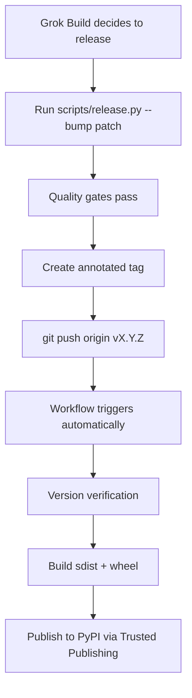

# Stele Context — Release Automation Guide (Grok Build Ready)

## Release Policy

Releases are performed using the dedicated release tooling to ensure consistency, quality, and traceability.

### When to Release
- After significant features, important bug fixes, or major tooling/documentation improvements.
- When several related changes have accumulated.
- Periodically during active development (recommended every 1–4 weeks).

Small incremental changes or minor refactors usually do **not** require an immediate release.

### How to Perform a Release (Standard Process)
Use the built-in CLI command:

```bash
# Patch release (most common)
stele-context release --bump patch --message "Description of changes" --yes --push

# Minor release
stele-context release --bump minor --message "..." --yes --push

# Specific version
stele-context release --version 1.4.0 --message "..." --yes --push
```

The tooling will automatically:
- Bump the version in `pyproject.toml` and `stele_context/__init__.py`
- Update `CHANGELOG.md` and `COMPLETE_PROJECT_DOCUMENTATION.md`
- Run quality gates (`ruff`, `mypy`, tests)
- Create an annotated git tag
- Push (which triggers automatic PyPI publishing via the workflow)

### Grok Build & Agent Automation
This project is explicitly designed to support **autonomous releases** by Grok Build agents.

After completing meaningful work, a Grok Build agent should use the `stele-context release` command (with the `--yes` flag) to cut a release and update PyPI without requiring manual intervention for the mechanical steps.

**Future goal**: With the addition of a `create_release` tool in the GitHub MCP integration, agents will also be able to create proper GitHub Release pages autonomously.

See the rest of this document for technical details and required platform capabilities.

This document describes how releases are performed and what is needed for **fully automated releases by Grok Build agents**.

## Current State (v1.3.2+)

### Dual-Trigger PyPI Publishing

The workflow [`.github/workflows/publish.yml`](../.github/workflows/publish.yml) supports two modes:

| Trigger | How it works | Recommended for |
|---------|--------------|-----------------|
| `push` tag `v*` | Fully automatic after `git push origin vX.Y.Z` | Grok Build agents, fast iteration |
| `release: published` | Manual creation of GitHub Release from the tag | Human review before publishing |

Both paths use **PyPI Trusted Publishing** (OIDC). No long-lived API tokens are stored.

### One-Command Release Helper

A new release script exists at `scripts/release.py`:

```bash
# Patch release (most common)
python -m scripts.release --bump patch --message "MCP storm resilience"

# Specific version + push everything
python -m scripts.release --version 1.3.3 --push
```

The script:
- Bumps version in `pyproject.toml` + `stele_context/__init__.py`
- Updates `CHANGELOG.md`
- Runs `ruff`, `mypy`, and `pytest`
- Creates an annotated git tag
- Can optionally push (triggering the automated PyPI path)

## Future Automation Setup (What Still Needs to Be Done)

To allow a Grok Build agent to perform **completely hands-off releases**, the following four items need to be completed:

### 1. `create_release` Tool in `grok_com_github` MCP Server

**Current limitation:** The connected GitHub MCP server (`grok_com_github`) only exposes read-only release tools:
- `get_latest_release`
- `list_releases`
- `get_release_by_tag`

**Required:** A write tool such as:
- `create_release(owner, repo, tag_name, name, body, draft=false, prerelease=false)`
- Or a more general `github_api` / `call_github` tool that can POST to `/repos/{owner}/{repo}/releases`

**Action needed:** Request this capability from the Grok team / MCP server maintainers.

Once available, a Grok Build agent can:
1. Run the local `scripts/release.py`
2. Use the new tool to create the GitHub Release (if manual review path is desired)

### 2. Repository Permissions for the Agent / Bot

For an agent to push tags and create releases, it needs:

**Minimum required permissions on `IronAdamant/stele-context`:**

- `Contents: Write` — for pushing tags and creating releases
- `Actions: Read` (or Write) — to inspect workflow runs
- `Pull requests: Write` (optional) — if the agent should open PRs for version bumps

**For PyPI Trusted Publishing (already configured):**
- The OIDC trust relationship between GitHub and PyPI must include the `publish.yml` workflow file.

**Recommended:** Create a dedicated GitHub App or Fine-Grained PAT (with minimal scopes) that Grok Build agents can use, rather than using the user's personal token.

### 3. Release Tooling & Changelog Automation

**Completed (current product):**
- `scripts/release.py` (core bumping + tagging + gates)
- **`stele-context release` CLI subcommand** (`cli_release.py`) — this is the standard process documented above, not a future item

**Nice-to-have future enhancements:**
- Automatic changelog generation from conventional commits (`git-cliff` or similar)
- Support for release candidates (`1.4.0-rc.1`)
- Pre-release checklist automation (update `COMPLETE_PROJECT_DOCUMENTATION.md`, run full benchmark suite, etc.)

### 4. Workflow Hardening

**Completed in v1.3.2:**
- Concurrency control (`cancel-in-progress`)
- Tag vs release trigger guard
- Version verification step (tag must match `pyproject.toml`)

**Future improvements:**
- Add a required "release approval" environment for tags pushed by bots
- Add SBOM / provenance attestation
- Separate "build" and "publish" jobs for better security (build on PR, publish only on tag)

## Recommended Release Flow for Grok Build Agents (Future Ideal)



When `create_release` becomes available, the agent can optionally insert a step to create a rich GitHub Release with the full changelog excerpt before or after the tag push.

## How to Request the Missing Pieces

If you are a maintainer or Grok Build platform engineer, the two highest-leverage missing items are:

1. **MCP Tool Request** — Add `create_release` (and ideally `update_release`) to the `grok_com_github` server.
2. **Repository Access** — Grant a Grok Build service account `Contents: Write` + `Actions: Read` on this repository (or use GitHub App).

---

## Standard Release Process (Going Forward)

**After any significant change or batch of changes, the following must be followed:**

1. Run quality gates locally (`ruff check`, `ruff format`, `mypy`, `pytest`).
2. Use the release tooling:
   ```bash
   stele-context release --version X.Y.Z --message "..." --push
   ```
   or
   ```bash
   python -m scripts.release --version X.Y.Z --message "..." --push
   ```
3. The tag push will automatically trigger the PyPI publish workflow.

This ensures consistent versioning, changelog maintenance, testing, tagging, and PyPI updates.

**v1.3.3** was the first release performed entirely with this new Grok Build automation.

---

*This document was created during a Grok Build iteration to make future releases first-class and agent-friendly.*

Last updated: 2026-05-15 (v1.3.3 release)
